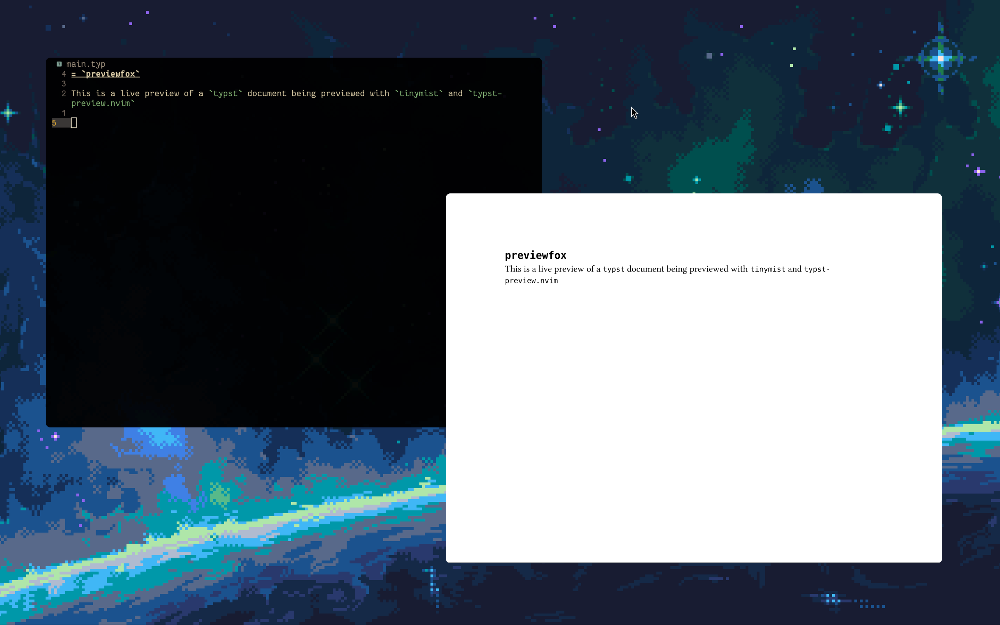
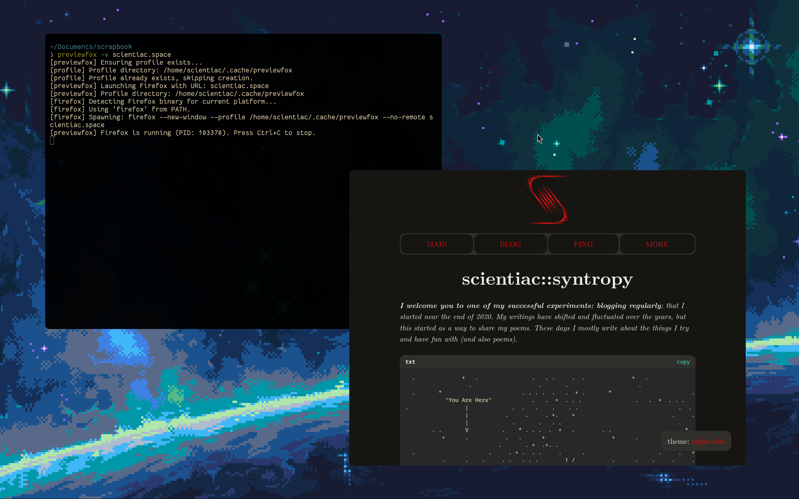
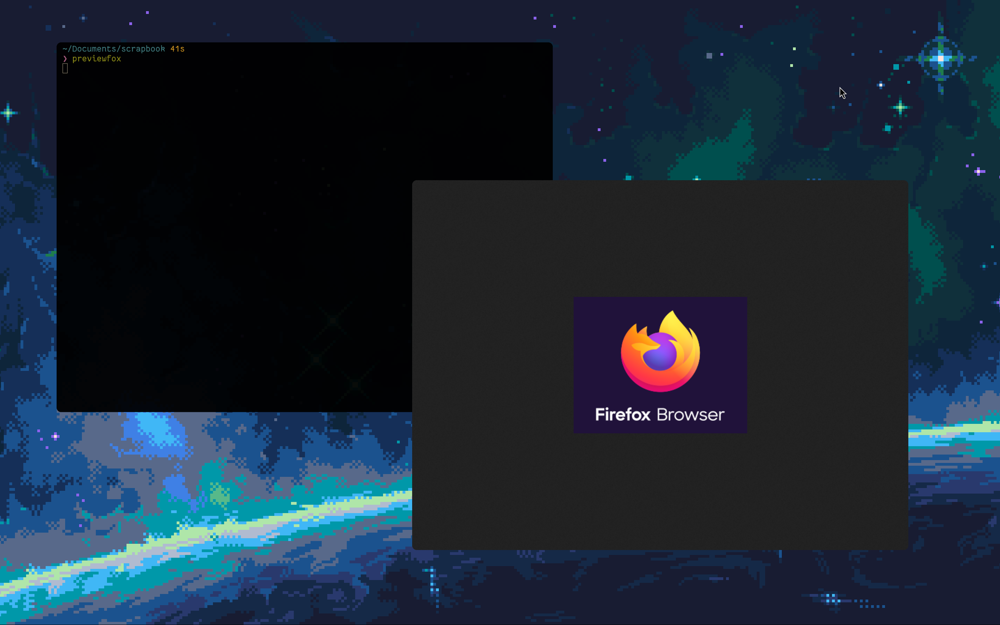

# previewfox

Launch Firefox with no UI chrome, just the content view. Made for live previews.

> [!IMPORTANT]
> This is not a fork or a custom browser, it just uses your existing installation of Firefox with a custom profile and user settings.

## Why?

When working on `typst` documents, I want a browser window that shows only the page content without tabs, toolbars, bookmarks, or sidebars getting in the way. A clean content-only view could also be used for live-previewing designs or kiosk setups.

`previewfox` creates a minimal Firefox profile that strips away all UI elements and opens a URL in a clean window. When you close `previewfox`, Firefox closes with it. (By Firefox I mean the custom Firefox window generated for preview and not your browser.)

## Usage

```sh
# Open a URL in preview mode:
previewfox http://localhost:3000

# Open the default page (about:logo):
previewfox

# Force-rebuild the profile:
previewfox --rebuild

# Check that all profile files are intact:
previewfox --health

# See detailed output:
previewfox --verbose http://localhost:3000
```

Run `previewfox --help` for all arguments and options.

## Installation

```sh
cargo install previewfox
```

Requires Firefox to be installed and accessible on your PATH.

## Showcase



| Site Verbose | Default |
| :----: | :----: |
|  |  |

## Don't wan't to install a binary?

This could very well be done with a bash script and you can use `previewfox.sh` instead of the binary if you prefer that.

`cargo` makes it easier to distribute the binary and since I use it for ``typst`` I can just install everything I need using just `cargo`.
Also, I don't know `powershell` or use it, so rust makes it easier to ship this script to windows, though I am not sure if defender lets you use it.
